# Mr. Blu Architecture

> Voice-first invoicing platform for contractors. Speak, review, send.

## Table of Contents
- [Project Structure](#project-structure)
- [Tech Stack](#tech-stack)
- [Authentication Flow](#authentication-flow)
- [Data Flow](#data-flow)
- [Component Hierarchy](#component-hierarchy)
- [State Management](#state-management)
- [API Routes](#api-routes)
- [Database Schema](#database-schema)
- [Voice-to-Invoice Pipeline](#voice-to-invoice-pipeline)
- [Deployment Architecture](#deployment-architecture)
- [Feature Map](#feature-map)
- [File Reference](#file-reference)

---

## Project Structure

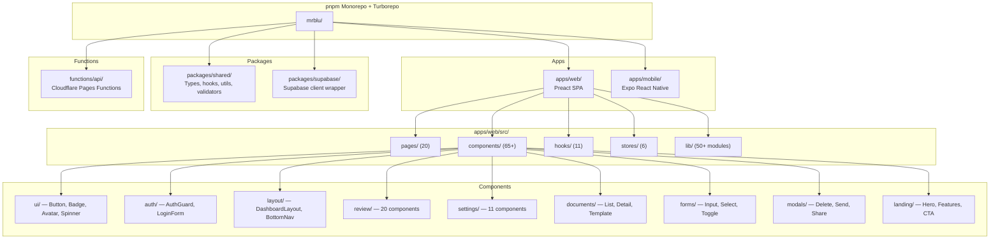

---

## Tech Stack

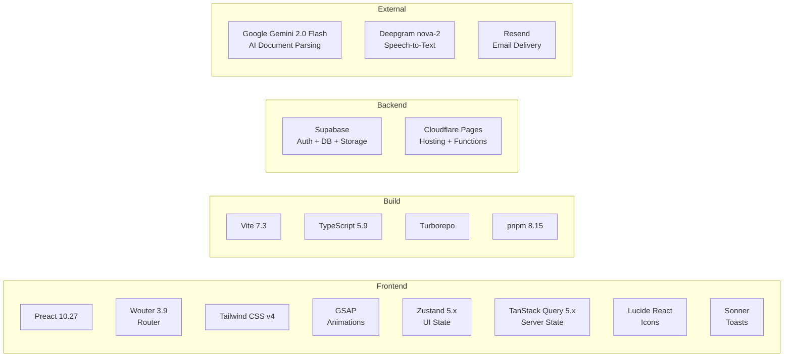

---

## Authentication Flow

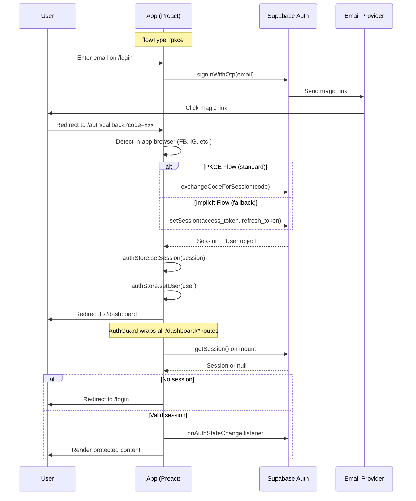

---

## Data Flow

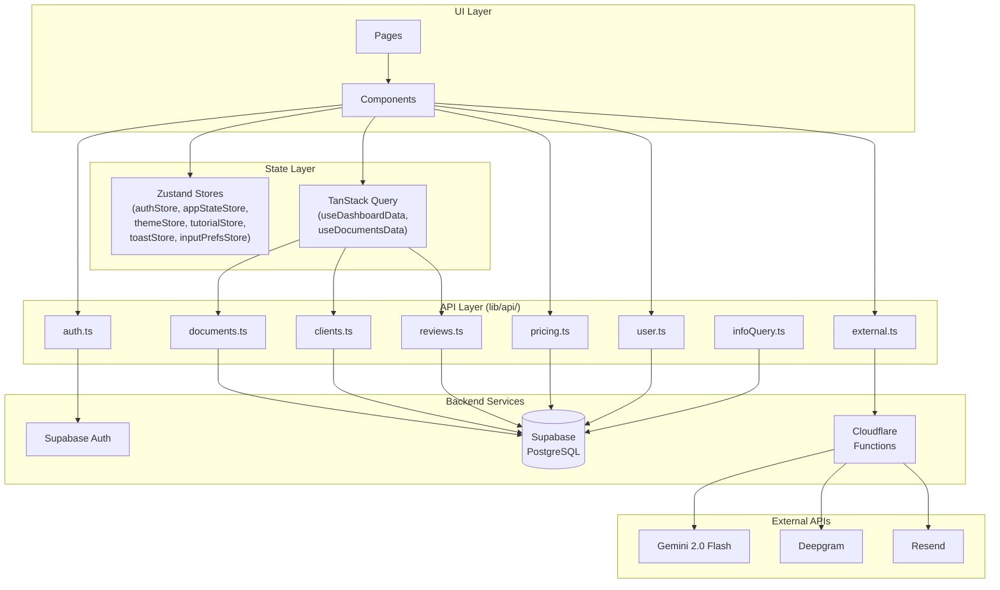

---

## Component Hierarchy

```mermaid
graph TD
    APP["App.tsx<br/>QueryClientProvider + Router"]

    APP --> LANDING["/ LandingPage"]
    APP --> LOGIN["/login LoginPage"]
    APP --> CALLBACK["/auth/callback AuthCallback"]
    APP --> DOCVIEW["/view/:type/:id DocumentViewPage<br/>(lazy-loaded)"]
    APP --> GUARD["AuthGuard"]

    GUARD --> DL["DashboardLayout<br/>(BottomNav + Blobs + Toaster)"]

    DL --> DASH["/dashboard<br/>DashboardHome"]
    DL --> DOCSPAGE["/dashboard/documents<br/>DocumentList"]
    DL --> DOCDETAIL["/dashboard/documents/:id<br/>DocumentDetail"]
    DL --> REVIEWPAGE["/dashboard/review<br/>ReviewPage"]
    DL --> REVIEWSLIST["/dashboard/reviews<br/>ReviewsList"]
    DL --> SETTINGSHUB["/dashboard/settings<br/>SettingsHub"]

    SETTINGSHUB --> PROFILE["ProfileSettings"]
    SETTINGSHUB --> BUSINESS["BusinessSettings"]
    SETTINGSHUB --> LANGUAGE["LanguageSettings"]
    SETTINGSHUB --> PRICEBOOK["PriceBook"]
    SETTINGSHUB --> CLIENTBOOK["ClientBook"]
    SETTINGSHUB --> CLIENTDETAIL["ClientDetailView"]
    SETTINGSHUB --> NOTIFICATIONS["NotificationsSettings"]
    SETTINGSHUB --> SECURITY["SecuritySettings"]
    SETTINGSHUB --> FEEDBACK["FeedbackSettings"]

    LANDING --> NAVBAR["Navbar"]
    LANDING --> HERO["HeroSection<br/>(HeroHeadline + HeroPhone)"]
    LANDING --> FEATURES["FeaturesSection<br/>(FeatureCard x6)"]
    LANDING --> HOW["HowItWorksSection<br/>(StepCard x3)"]
    LANDING --> TESTIMONIALS["TestimonialsSection"]
    LANDING --> CTA["CTASection"]
    LANDING --> FOOTER["Footer"]

    REVIEWPAGE --> VOICEINPUT["VoiceInput<br/>(RecordButton + Transcript)"]
    REVIEWPAGE --> TRANSFORM["TransformReview<br/>(Client + LineItems + Totals)"]
    REVIEWPAGE --> QUERYFLOW["QueryResultsFlow"]
    REVIEWPAGE --> SENDFLOW["SendDocumentFlow"]
    REVIEWPAGE --> SHAREMODAL["ShareLinkModal"]
    REVIEWPAGE --> MERGEFLOW["MergeDocumentsFlow"]
    REVIEWPAGE --> CLONEFLOW["CloneDocumentFlow"]
    REVIEWPAGE --> DONESTATE["DoneState"]
```

---

## State Management

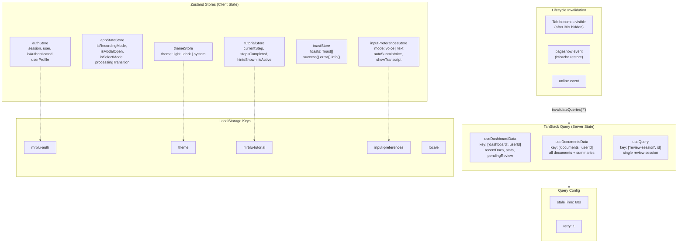

---

## API Routes

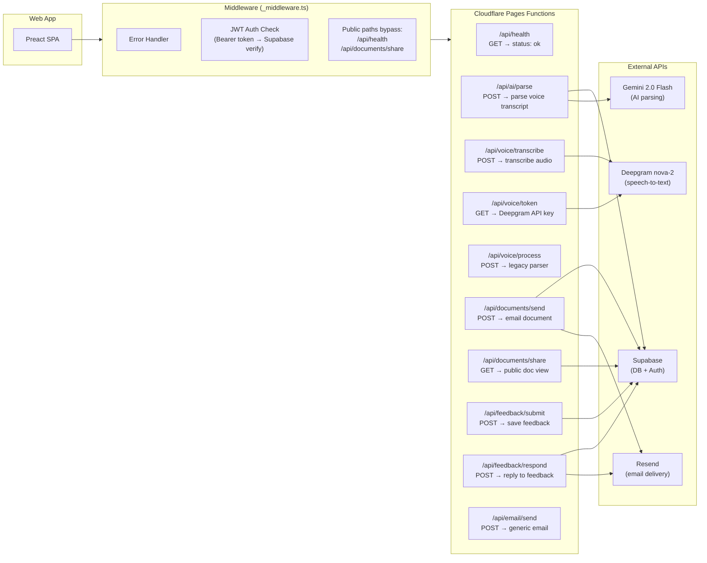

---

## Database Schema

```mermaid
erDiagram
    auth_users ||--o| profiles : "has profile"
    auth_users ||--o{ clients : "owns"
    auth_users ||--o{ documents : "creates"
    auth_users ||--o{ contracts : "creates"
    auth_users ||--o{ price_items : "defines"
    auth_users ||--o{ services : "defines"
    auth_users ||--o{ review_sessions : "initiates"
    auth_users ||--o{ sent_documents : "sends"
    auth_users ||--o{ error_logs : "triggers"
    auth_users ||--o{ admin_comments : "submits"
    clients ||--o{ documents : "receives"
    clients ||--o{ contracts : "signs"
    price_items ||--o{ price_aliases : "has aliases"

    auth_users {
        uuid id PK
        text email
    }

    profiles {
        uuid id PK "FK → auth.users"
        text full_name
        text business_name
        text phone
        text email
        text address
        text logo_url
        text license_number
        text tax_id
        text website
        timestamptz created_at
        timestamptz updated_at
    }

    clients {
        uuid id PK
        uuid user_id FK
        text name
        text email
        text phone
        text address
        text notes
        timestamptz created_at
    }

    documents {
        uuid id PK
        uuid user_id FK
        uuid client_id FK
        text document_type "invoice | estimate"
        text document_number "INV-2026-0001"
        text title
        jsonb line_items "array of items"
        numeric subtotal
        numeric tax_rate
        numeric tax_amount
        numeric total
        date due_date
        text notes
        text status "draft|sent|pending|paid|overdue|cancelled"
        text original_transcript
        text pdf_url
        timestamptz paid_at
        timestamptz created_at
    }

    contracts {
        uuid id PK
        uuid user_id FK
        uuid client_id FK
        text title
        jsonb content
        text status "draft|sent|signed|cancelled"
        text original_transcript
        timestamptz signed_at
        timestamptz created_at
    }

    sent_documents {
        uuid id PK
        uuid user_id FK
        uuid document_id
        text document_type "invoice|estimate|contract"
        text recipient_email
        text recipient_phone
        text delivery_method "email|sms|whatsapp"
        text share_token UK
        timestamptz sent_at
        timestamptz viewed_at
    }

    review_sessions {
        uuid id PK
        uuid user_id FK "FK → profiles"
        text status "pending|in_progress|completed|cancelled"
        text intent_type "document_action|information_query|document_clone|document_merge|document_send|document_transform"
        text original_transcript
        text audio_url
        jsonb parsed_data
        jsonb actions
        jsonb query_data
        jsonb query_result
        jsonb confidence
        text summary
        uuid created_document_id
        text created_document_type
        uuid source_document_id
        text source_document_type
        timestamptz completed_at
    }

    price_items {
        uuid id PK
        uuid user_id FK
        text name
        text description
        text category "material|labor|service|tools|equipment|rental|permit|disposal|other"
        numeric unit_price
        text unit "each, sqft, hour, etc."
        text currency "USD"
        numeric min_price
        numeric max_price
        int times_used
        text source "manual|voice|import"
        tsvector search_vector "generated: name + description"
        timestamptz last_used_at
    }

    price_aliases {
        uuid id PK
        uuid price_item_id FK
        text alias
    }

    services {
        uuid id PK
        uuid user_id FK
        text name
        text description
        jsonb items "bundled line items"
        int times_used
        timestamptz last_used_at
    }

    error_logs {
        uuid id PK
        text severity "info|warn|error|critical"
        text error_type
        text message
        text stack
        uuid user_id FK
        text request_path
        text request_method
        int status_code
        jsonb metadata
        boolean resolved
    }

    admin_comments {
        uuid id PK
        uuid user_id FK
        text comment
        text category "general|bug|feature|complaint|praise"
        text page_context
        timestamptz created_at
    }
```

---

## Voice-to-Invoice Pipeline

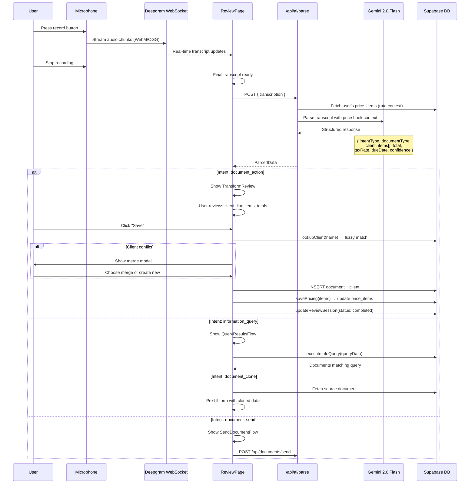

---

## Deployment Architecture

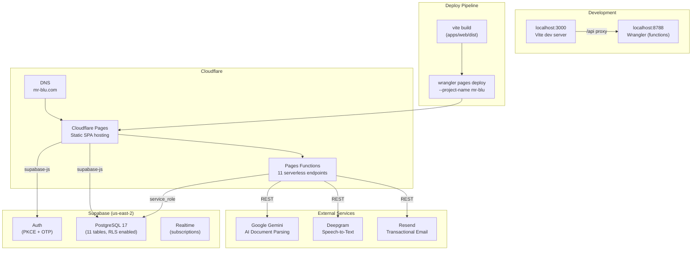

---

## Feature Map

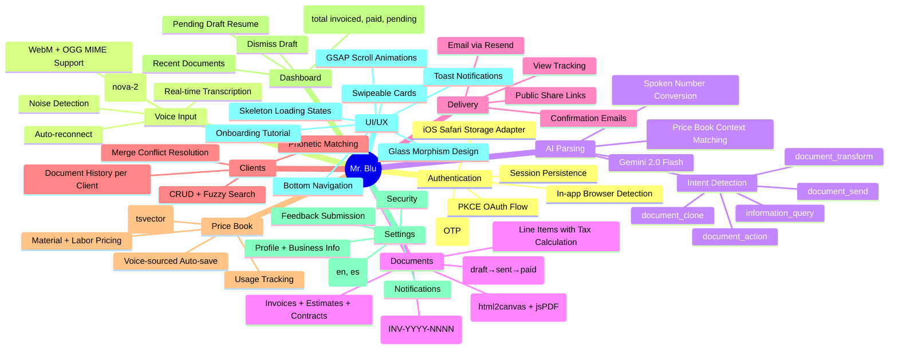

---

## User Journey

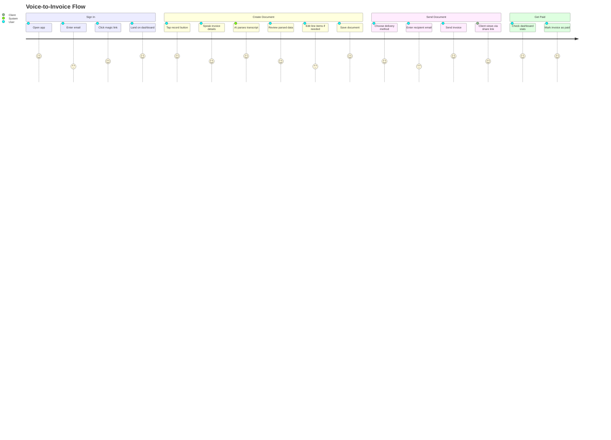

---

## Routing Map

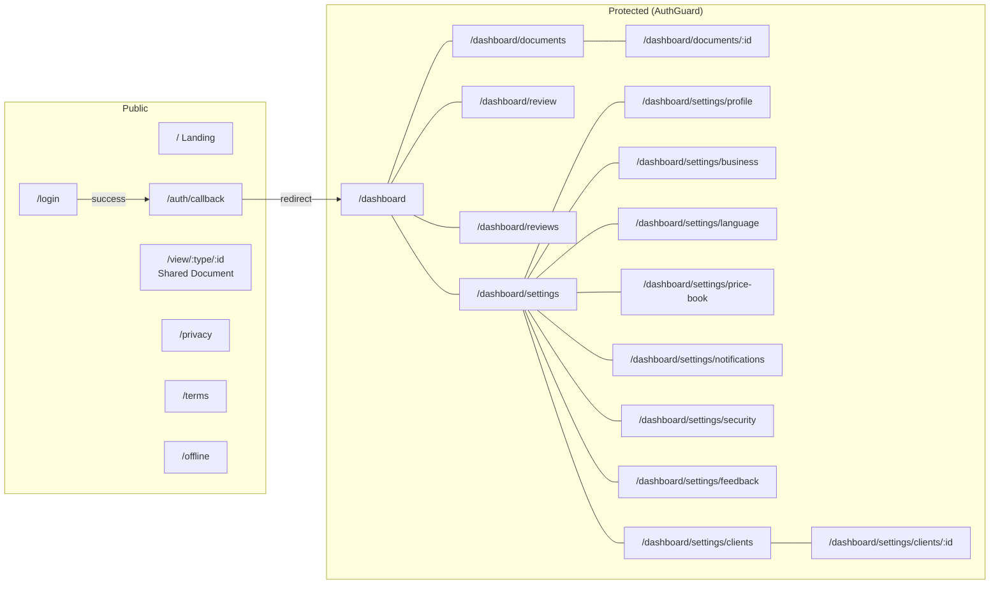

---

## File Reference

### Directories

| Directory | Purpose |
|-----------|---------|
| `apps/web/src/pages/` | Route page components (20 files) |
| `apps/web/src/components/ui/` | Reusable UI primitives |
| `apps/web/src/components/auth/` | Authentication guards & forms |
| `apps/web/src/components/layout/` | Dashboard layout, bottom nav |
| `apps/web/src/components/review/` | Voice review workflow (20 components) |
| `apps/web/src/components/settings/` | Settings sub-pages (11 components) |
| `apps/web/src/components/documents/` | Document list, detail, template |
| `apps/web/src/components/landing/` | Marketing landing page sections |
| `apps/web/src/components/forms/` | Form input components |
| `apps/web/src/components/modals/` | Modal dialogs |
| `apps/web/src/hooks/` | Custom hooks (dashboard, documents, voice, review) |
| `apps/web/src/stores/` | Zustand stores (6 stores) |
| `apps/web/src/lib/api/` | API layer (8 domain modules) |
| `apps/web/src/lib/supabase/` | Supabase client config |
| `apps/web/src/lib/i18n/` | Internationalization (en, es) |
| `apps/web/src/lib/parsing/` | Document parsing logic |
| `apps/web/src/lib/templates/` | Document template rendering |
| `apps/web/src/lib/tutorial/` | Onboarding tutorial config |
| `functions/api/` | Cloudflare Pages Functions (11 endpoints) |
| `packages/shared/` | Shared types, hooks, utils, validators |
| `packages/supabase/` | Supabase client singleton |

### Key Files

| File | Purpose |
|------|---------|
| `apps/web/src/main.tsx` | App entry point |
| `apps/web/src/app.tsx` | Router, QueryClient, lifecycle hooks |
| `apps/web/src/lib/supabase/client.ts` | Supabase init (PKCE, custom storage) |
| `apps/web/src/stores/authStore.ts` | Auth session + user state |
| `apps/web/src/hooks/useVoiceRecording.ts` | Deepgram WebSocket voice input |
| `apps/web/src/lib/api/documents.ts` | Document CRUD, save, send, share, PDF |
| `apps/web/src/lib/api/external.ts` | AI parse, Deepgram token, email send |
| `apps/web/src/lib/api/infoQuery.ts` | Natural language document queries |
| `apps/web/src/lib/i18n/translations.ts` | All translations (~1950 lines) |
| `functions/api/ai/parse.ts` | Gemini AI document parser |
| `functions/api/documents/send.ts` | Email document via Resend |
| `functions/api/_middleware.ts` | JWT auth + error handling |
| `apps/web/wrangler.toml` | Cloudflare deployment config |
| `apps/web/vite.config.ts` | Vite build config with Preact aliases |

### Environment Variables

| Variable | Service | Used In |
|----------|---------|---------|
| `SUPABASE_URL` | Supabase | Client + Functions |
| `SUPABASE_SERVICE_ROLE_KEY` | Supabase | Functions (server-side) |
| `SUPABASE_ANON_KEY` | Supabase | Client (browser) |
| `GEMINI_API_KEY` | Google AI | `/api/ai/parse` |
| `DEEPGRAM_API_KEY` | Deepgram | `/api/voice/token`, `/api/voice/transcribe` |
| `RESEND_API_KEY` | Resend | `/api/documents/send`, `/api/feedback/respond` |
| `EMAIL_FROM_DOMAIN` | Resend | Email sender domain |
